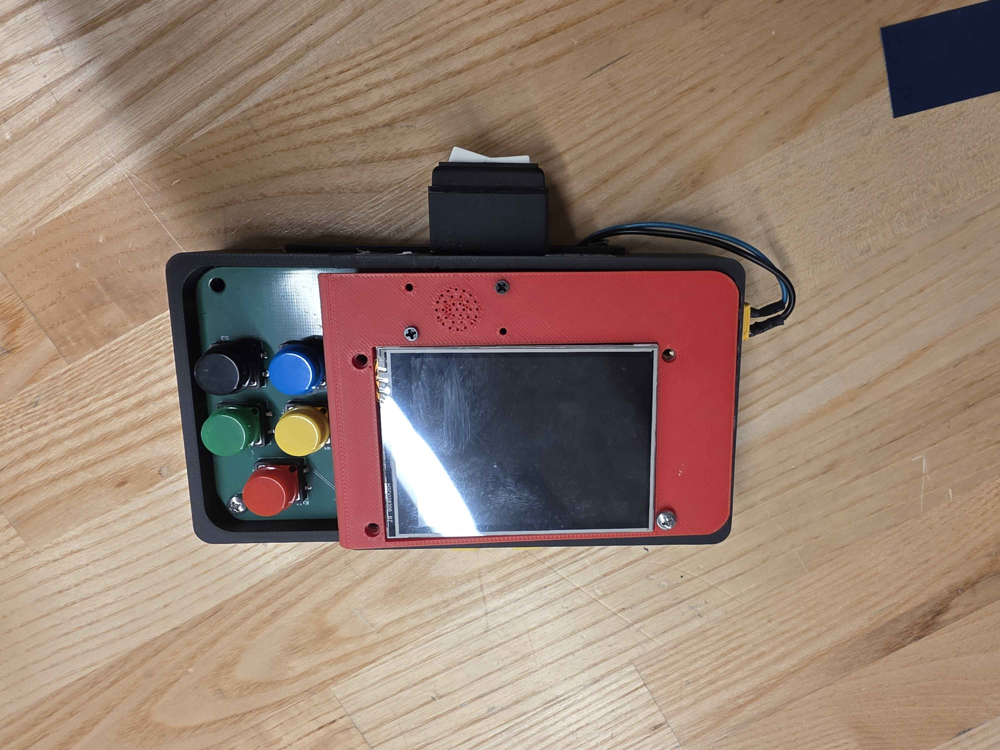
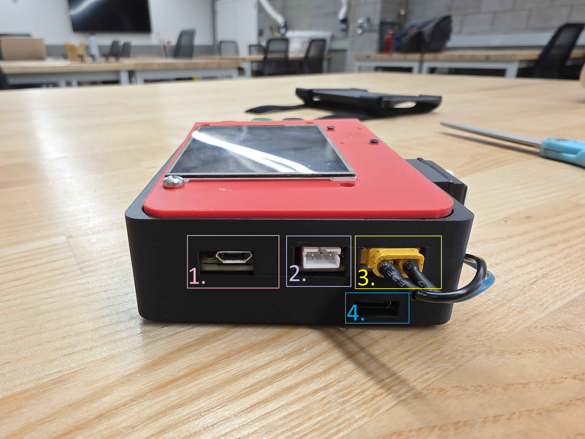
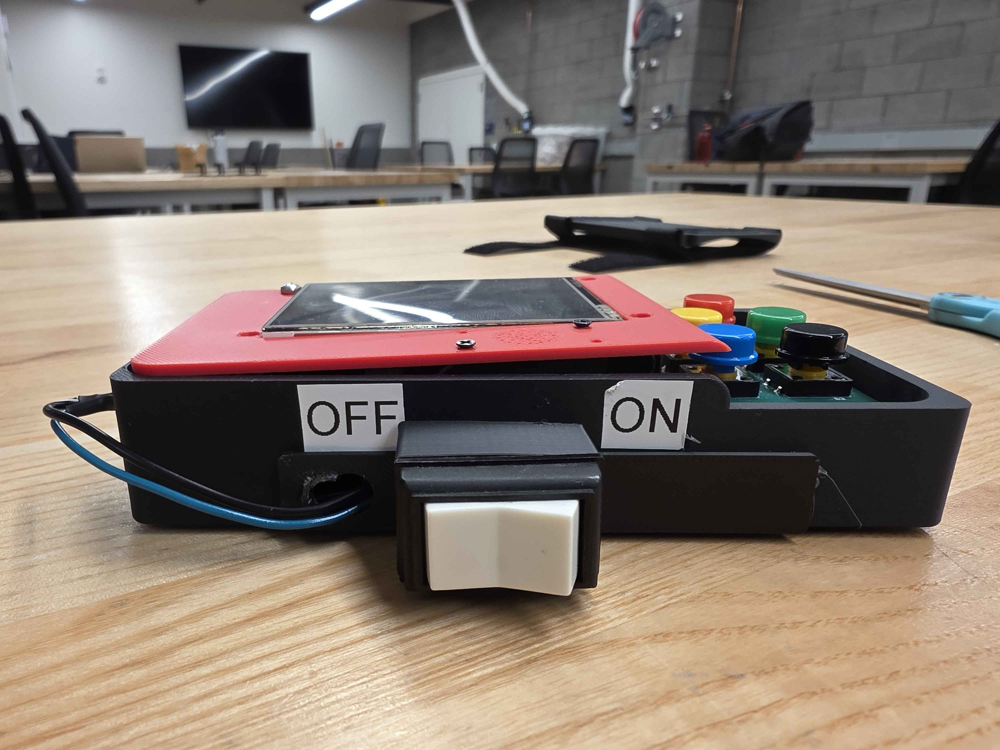

<!-- # Arm Monitor 2025-2026 Documentation -->
# Arm Monitor 5/15 Notes
1. Overview
2. Hardware Design
3. Software

## 1. Overview

## 2. Hardware Design
### Side Images and Descriptions

1. USB-B for Raspberry Pi Pico W2. For continued battery health, ensure that the switch located at the bottom of the arm monitor is in the off position. You can also unplug 3. (XT30).
2. Physically exposed UART pins. This was scrapped following the wireless implementation, but can be used as a backup with software adjustments. 
3. XT30 to receive power from the LiPo battery. Unplug this or turn the arm monitor off when plugging the RPI Pico W2 to flash code (1.).
4. USB-C to the TP4056 charging module for the LiPo battery. Plug into this to charge the battery. It will appear red while charging and blue when complete. Due to rushed CAD design, the LED inside isn't immediately visible, but can be seen if one peers into the monitor.

Bottom side of the arm monitor. The switch, with the left side depressed, is in the off mode. On switching to on, the device will draw current from the onboard LiPo battery. 

If the device does not turn on, there may be a few considerations:
1. The XT30 is not plugged in: Plug it in
2. The internal JST1.25 connecting the battery to the TP4056 charging module has come undone: remove the top screws, remove the PCB, and reattach the two.
3. The internal soldering connections on the TP4056 charging module have come undone: remove the top screws, remove the PCB, and resolder the connections
4. The battery does not have enough charge: plug the device in through the bottom USB-C connection to charge the battery.

## 3. Firmware
Two software elements are required to allow the connection to work. 
1. The exoskeletion must start the server. This is done through opening and enabling the hotspot connection that is as follows: **SSID: ralph password: something**. This must be started before the arm monitor is powered on
2. Arm monitor will attempt to connect to the server. It may fail, for which the easiest solution will be to power cycle the arm monitor until a successful connection is made. The error codes that may appear on screen will be discussed in the Arm Monitor section of software.

### Ralph Firmware
As of right now, the necessary firmware for the ralph is not implemented. 
We will need to implement this tonight. 

An example using threading is located in PiHost.py in this branch. We will need to start the server in parallel with the rest of the functionality of the exo. It will look to receive data from the arm monitor. If it receives valid data, it will acquire the shared lock for the dictionary that holds the data and update it. 

I did update the `arm_monitor_dummy.py` file in the current exo pi, though it is not asynchronous. 

Look to `PiHostReal.py` and try to either copy paste it in and pray or implement the server. Given that the exo is running in asynch, we cannot use the threading that was used in `PiHost.py`.

### Arm Monitor Firmware
I believe the majority of changes on the arm monitor side are relating to the text that is on the screen. It may be in your interest to switch the "Mode 1" and "Mode 2" etc. text to the actual modes used on the exo.

Here are the potential connection error codes and their meanings
* -3: wrong password
* -2: network not found
* -1: hardware crash, power off the arm monitor for a few seconds before powering it back on
* 0: idle
* 1: connecting to the network, found the network and passed the password check but waiting for Pi4 to assign an IP
* 2: transition
* 3: connection successful

Upon reaching 3, the arm monitor will enter height calibration mode. 

Height data is sent as the following

`Height:##`

Where ## is the inputted height of the person in inches

Mode data is sent in the form 

`Mode #`

Where # is the mode number. The mode numbers and buttons align with one another, except the kill switch. Kill button is listed as mode 5.